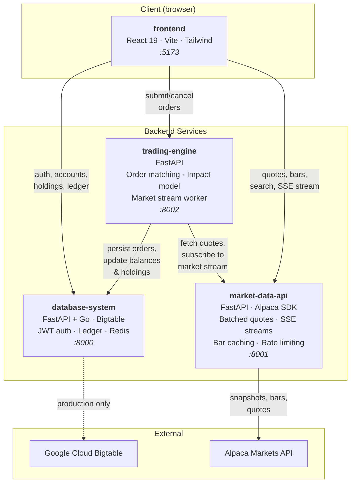

# Orion Trading Platform

A distributed paper-trading platform that lets users place simulated stock orders against real-time market data, track portfolio performance, and view detailed ledger history. Built as a semester-long software engineering project at Rice University (COMP 413, Spring 2026).

## Architecture

Orion is four independently deployable microservices. The frontend talks to all three backends; the trading engine coordinates between the database and market data services to execute and settle orders.



## Repositories

| Repo | Language | What it does |
|------|----------|--------------|
| [frontend](https://github.com/orion-trading-platform/frontend) | TypeScript | React SPA with Google OAuth, real-time order entry with SSE price streaming, interactive stock charts (Recharts), portfolio dashboard, wallet deposit/withdraw, ledger and transaction history views. Monorepo with shared ui-kit, style tokens, and email templates. |
| [database-system](https://github.com/orion-trading-platform/database-system) | Python, Go | Core data layer. Python (FastAPI) for local dev with an in-memory Bigtable mock; Go (Chi) for production against GCP Bigtable. Handles user registration/login (Argon2id hashing, JWT access/refresh tokens, Redis-backed revocation), account balances with optimistic locking, holdings, watchlists, ticker directory, market data ingestion, order storage, and a unified ledger for all transaction types. Scalar API docs at /docs. |
| [trading-engine](https://github.com/orion-trading-platform/trading-engine) | Python | Order matching service. Accepts market and limit orders, validates against account cash/holdings, executes fills using a quote-driven impact model (sqrt price impact curve for large orders beyond top-of-book liquidity), and settles by updating balances, holdings, and ledger entries. A background worker subscribes to the market data SSE stream and re-evaluates resting limit orders when quotes change. |
| [market-data-api](https://github.com/orion-trading-platform/market-data-api) | Python | Proxy layer over the Alpaca Markets API. Provides stock search, snapshots, latest quotes, historical OHLCV bars, and real-time SSE price streams. Implements request batching (50ms window to coalesce concurrent requests into single upstream calls), an in-memory cache with TTL, a rate limiter (195 calls/min against Alpaca's 200 cap), inflight deduplication to prevent duplicate fetches, and a background worker that pre-warms snapshot caches for held tickers. |
| [.github](https://github.com/orion-trading-platform/.github) | Python | Contains the dev orchestrator script (`dev.py`) for one-command local setup and a setup guide. |

## Running Locally

Prerequisites: Git, Python 3.13+, [uv](https://docs.astral.sh/uv/), Node.js 20+

The fastest way is to use the dev orchestrator. Clone this repo (or just grab `dev.py`), place it in a parent directory, and run:

```bash
python dev.py
```

The script clones all four service repos, creates `.env` files from templates, installs dependencies (`uv sync` for Python services, `npm install` for the frontend), and launches everything in one terminal with color-coded output. Use `Ctrl+C` to stop all services. Run `python dev.py -f` to skip setup and relaunch.

Before the first run you will need to fill in a few API keys in the generated `.env` files. The trading engine and database system work out of the box with local defaults, but the market data API requires Alpaca API credentials (free paper trading account at [alpaca.markets](https://alpaca.markets)) and the frontend login requires a Google OAuth client ID. See each repo's `.env.example` for details.

### Manual Setup

If you prefer to run services individually, start them in this order:

1. Database system on port 8000 (with `USE_LOCAL_DB=true`, no GCP needed)
2. Market data API on port 8001 (needs Alpaca keys)
3. Trading engine on port 8002
4. Frontend on port 5173

Each repo's README has standalone setup instructions.

### Running Tests

Each backend has its own test suite that runs against mocked dependencies:

```bash
cd database-system/api && uv run pytest
cd market-data-api && uv run pytest
cd trading-engine && uv run pytest
```

The database system also includes JMeter load test plans under `jmeter/`.

## Tech Stack

Python 3.13, FastAPI, Go (Chi router), Google Cloud Bigtable, Redis, React 19, Vite, Tailwind CSS, Recharts, Alpaca Markets SDK, Docker, Argon2id, JWT (HS256), Server-Sent Events, uv package manager.